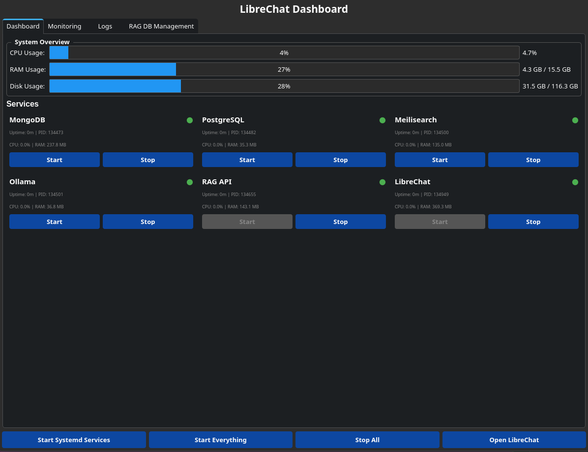

# LibreChat Dashboard for CachyOS (Arch Linux)

<p align="center">
  
</p>

A comprehensive setup guide and dashboard application for running LibreChat locally on CachyOS (Arch Linux) with Ollama integration, Meilisearch for conversation search, and RAG (Retrieval-Augmented Generation) for persistent document knowledge.

> ⚠️ **Note:** This is a comprehensive setup guide requiring manual configuration of multiple services. Plan for 1-2 hours for a fresh installation. The dashboard simplifies daily management after initial setup.

**Includes a modern monitoring dashboard with real-time graphs and service management!**

---

## Prerequisites Installation

### 1. Node.js (via nvm)

```bash
# Download and install nvm
curl -o- https://raw.githubusercontent.com/nvm-sh/nvm/v0.40.3/install.sh | bash

# Reload shell configuration (or restart terminal)
source ~/.bashrc
# OR without restarting:
\. "$HOME/.nvm/nvm.sh"

# Install Node.js 22
nvm install 22

# Verify installation
node -v    # Should show v22.21.1
npm -v     # Should show 10.9.4
```

### 2. Git

```bash
sudo pacman -S git
```

### 3. MongoDB

```bash
# Install MongoDB from AUR
yay -S mongodb-bin

# Create required directories
sudo mkdir -p /var/lib/mongodb
sudo mkdir -p /var/log/mongodb

# Set proper ownership
sudo chown -R mongodb:mongodb /var/lib/mongodb
sudo chown -R mongodb:mongodb /var/log/mongodb

# Create systemd service override (IMPORTANT - fixes startup issues)
sudo mkdir -p /etc/systemd/system/mongodb.service.d/
sudo nano /etc/systemd/system/mongodb.service.d/override.conf
```

Add this content to `override.conf`:
```ini
[Service]
Type=simple
```

```bash
# Enable and start MongoDB
sudo systemctl daemon-reload
sudo systemctl enable mongodb
sudo systemctl start mongodb

# Verify MongoDB is running
sudo systemctl status mongodb
sudo ss -tlnp | grep 27017    # Should show MongoDB listening

# Test connection (optional)
mongosh
# Type 'exit' to quit
```

**Common Issue:** If MongoDB fails with socket error, run:
```bash
sudo rm -f /tmp/mongodb-27017.sock
sudo systemctl restart mongodb
```

### 4. Meilisearch

Meilisearch provides powerful search capabilities for your LibreChat conversations.

```bash
# Download Meilisearch (check https://github.com/meilisearch/meilisearch/releases for latest version)
mkdir -p ~/.local/bin
cd ~/.local/bin
wget https://github.com/meilisearch/meilisearch/releases/download/v1.29.0/meilisearch-linux-amd64
mv meilisearch-linux-amd64 meilisearch
chmod +x meilisearch

# Verify ~/.local/bin is in PATH (should already be for most systems)
echo $PATH | grep ".local/bin" || echo 'export PATH="$HOME/.local/bin:$PATH"' >> ~/.bashrc

# Reload PATH
source ~/.bashrc

# Verify installation
meilisearch --version    # Should show: meilisearch 1.29.0

# Generate a master key (save this securely!)
openssl rand -base64 32
# Copy the output - this is your MEILI_MASTER_KEY

# Create data directory
mkdir -p ~/.local/share/meilisearch
```

Create systemd service for Meilisearch:

```bash
sudo nano /etc/systemd/system/meilisearch.service
```

Add this content (replace `YOUR_MASTER_KEY_HERE` with your generated key and `x` with your username):
```ini
[Unit]
Description=Meilisearch
After=network.target

[Service]
Type=simple
User=x
WorkingDirectory=/home/x/.local/share/meilisearch
ExecStart=/home/x/.local/bin/meilisearch \
  --http-addr 127.0.0.1:7700 \
  --env production \
  --master-key YOUR_MASTER_KEY_HERE
Restart=on-failure

[Install]
WantedBy=multi-user.target
```

```bash
# Enable and start Meilisearch
sudo systemctl daemon-reload
sudo systemctl enable meilisearch
sudo systemctl start meilisearch

# Verify Meilisearch is running
sudo systemctl status meilisearch
```

### 5. PostgreSQL with pgvector (for RAG)

RAG (Retrieval-Augmented Generation) allows LibreChat to maintain persistent document knowledge bases that work across conversations.

```bash
# Install PostgreSQL
sudo pacman -S postgresql

# Initialize the database
sudo -u postgres initdb -D /var/lib/postgres/data

# Start and enable PostgreSQL
sudo systemctl enable postgresql
sudo systemctl start postgresql
sudo systemctl status postgresql

# Install pgvector extension
yay -S pgvector

# Create database and user for RAG
sudo -u postgres psql
```

In the PostgreSQL prompt, run these commands:
```sql
CREATE USER raguser WITH PASSWORD 'ragpassword';
CREATE DATABASE ragdb OWNER raguser;
\c ragdb
CREATE EXTENSION vector;
\q
```

### 6. RAG API Setup

```bash
# Pull Ollama embedding model
ollama pull nomic-embed-text

# RAG API requires Python 3.11 (not compatible with 3.12+)
# If you have Python 3.12+, use pyenv to install 3.11:
# pyenv install 3.11.14
# pyenv local 3.11.14

# Create XDG-compliant source directory
mkdir -p ~/.local/src
cd ~/.local/src

# Clone RAG API repository
git clone https://github.com/danny-avila/rag_api.git
cd rag_api

# If using pyenv, set local Python version
# pyenv local 3.11.14

# Create Python virtual environment
python -m venv venv
source venv/bin/activate

# Fix cryptography version in requirements
nano requirements.lite.txt
# Change line 29 from cryptography==45.0.5 to cryptography==43.0.3

# Install lite dependencies (saves ~7GB compared to full requirements)
pip install -r requirements.lite.txt

# If tiktoken fails to build:
pip install tiktoken --no-build-isolation

# Note: If you move rag_api directory after creating venv, you'll need to rebuild it
# as virtual environments have hardcoded paths

# Create .env file for RAG API
nano .env
```

Add this content to `.env`:
```env
# PostgreSQL Database
POSTGRES_DB=ragdb
POSTGRES_USER=raguser
POSTGRES_PASSWORD=ragpassword
DB_HOST=localhost
DB_PORT=5432

# Ollama Embeddings
EMBEDDINGS_PROVIDER=ollama
OLLAMA_BASE_URL=http://localhost:11434
EMBEDDINGS_MODEL=nomic-embed-text

# API Settings
RAG_HOST=0.0.0.0
RAG_PORT=8000

# Debug (optional)
DEBUG_RAG_API=True
```

---

## LibreChat Installation

### 7. Clone and Configure LibreChat

```bash
# Clone repository to XDG-compliant location
mkdir -p ~/.local/src
cd ~/.local/src
git clone https://github.com/danny-avila/LibreChat.git
cd LibreChat

# Create environment file
cp .env.example .env

# Edit .env file
nano .env
```

Update these settings in `.env`:
```env
# MongoDB connection
MONGO_URI=mongodb://localhost:27017/LibreChat

# Meilisearch configuration
SEARCH=true
MEILI_NO_ANALYTICS=true
MEILI_HOST=http://localhost:7700
MEILI_MASTER_KEY=YOUR_MASTER_KEY_HERE

# RAG API Configuration
RAG_API_URL=http://localhost:8000
```

Replace `YOUR_MASTER_KEY_HERE` with the master key you generated in step 4.

### 8. Configure Ollama (Optional)

If you want to use Ollama with local models:

```bash
# Create Ollama configuration
nano librechat.yaml
```

Add this configuration (replace model names with your installed models):
```yaml
version: 1.1.7
cache: true

endpoints:
  custom:
    - name: "Ollama"
      apiKey: "ollama"
      baseURL: "http://localhost:11434/v1"
      models:
        default:
          - "gemma3:4b-it-qat"
          - "qwen3:1.7b"
        fetch: false
      titleConvo: true
      titleModel: "gemma3:4b-it-qat"
      modelDisplayLabel: "Ollama"
```

**Note:** Check your installed Ollama models with:
```bash
ollama list
```

Verify Ollama is running:
```bash
sudo systemctl status ollama
```

---

## Building and Running

### 9. Initial Build

```bash
# Install dependencies
npm ci

# Build the frontend (takes a few minutes)
npm run frontend

# Start the backend
npm run backend
```

Access LibreChat at: **http://localhost:3080**

---

## Dashboard Application

For easier service management and monitoring, use the included dashboard application.

### Installation

```bash
# Make the installer executable
chmod +x install-dashboard.sh

# Run the installer
./install-dashboard.sh
```

The installer will:
- Install required system packages via pacman (PyQt6, PyQt6-Charts, python-psutil)
- Install the dashboard to `/usr/local/bin/`
- Create a desktop entry for your application menu

### Usage

**Launch the dashboard:**
- Find "LibreChat Dashboard" in your application menu
- Pin it to your taskbar for quick access
- Or run from terminal: `librechat-dashboard`

**Features:**
- ✅ **Dashboard Tab** - Service cards with real-time CPU/RAM usage and system overview
- ✅ **Monitoring Tab** - Live CPU and RAM usage graphs (60-second history)
- ✅ **Logs Tab** - Consolidated logs from all services in one place
- ✅ **Real-time status indicators** - Green/red/gray dots show service status
- ✅ **One-click controls** - Start/stop individual services or everything at once
- ✅ **Resource monitoring** - See which services are using resources
- ✅ **Built-in help** - Menu bar with guides and cheat sheets

**Services monitored:**
- MongoDB (systemd) - Database
- PostgreSQL (systemd) - RAG database  
- Meilisearch (systemd) - Search engine
- Ollama (systemd) - AI models
- RAG API (manual process - port 8000)
- LibreChat Backend (manual process - port 3080)

**Quick Actions:**
- **Start Systemd Services** - Start all background services with one password prompt
- **Start Everything** - Start all services in the correct sequence
- **Stop All** - Gracefully stop everything
- **Open LibreChat** - Launch browser to http://localhost:3080

---

## Daily Usage

### Option 1: Using the Dashboard (Recommended)

The easiest way to start LibreChat:

1. **Launch the Dashboard** from your application menu or taskbar
2. **Click "Start Everything"** - Starts all services in sequence
3. Wait for all status lights to turn green
4. **Click "Open LibreChat"** or visit http://localhost:3080

The dashboard shows you live status, resource usage, and logs for all services!

### Option 2: Manual Start (Terminal)

```bash
# 1. Check services are running (should auto-start)
sudo systemctl status mongodb
sudo systemctl status meilisearch
sudo systemctl status postgresql

# 2. Start RAG API (in a separate terminal)
cd ~/.local/src/rag_api
source venv/bin/activate
uvicorn main:app --host 0.0.0.0 --port 8000

# 3. Start LibreChat (in another terminal)
cd ~/.local/src/LibreChat
npm run backend

# 4. Open browser to http://localhost:3080
```

---

## Adding New Ollama Models

When you want to use a new model:

```bash
# 1. Pull the model
ollama pull model-name

# 2. Edit configuration
cd ~/.local/src/LibreChat
nano librechat.yaml

# 3. Add model to the list under 'default:' (each on new line with -)
#    - "existing-model"
#    - "new-model-name"

# 4. Restart backend (Ctrl+C in terminal, then)
npm run backend

# 5. Refresh browser
```

---

## Useful Commands

### MongoDB
```bash
sudo systemctl start mongodb      # Start MongoDB
sudo systemctl stop mongodb       # Stop MongoDB
sudo systemctl restart mongodb    # Restart MongoDB
sudo systemctl status mongodb     # Check status
```

### PostgreSQL
```bash
sudo systemctl start postgresql       # Start PostgreSQL
sudo systemctl stop postgresql        # Stop PostgreSQL
sudo systemctl restart postgresql     # Restart PostgreSQL
sudo systemctl status postgresql      # Check status
```

### Meilisearch
```bash
sudo systemctl start meilisearch      # Start Meilisearch
sudo systemctl stop meilisearch       # Stop Meilisearch
sudo systemctl restart meilisearch    # Restart Meilisearch
sudo systemctl status meilisearch     # Check status
```

### RAG API
```bash
cd ~/.local/src/rag_api           # Navigate to RAG API directory
source venv/bin/activate          # Activate virtual environment
uvicorn main:app --host 0.0.0.0 --port 8000  # Start RAG API
# Ctrl+C to stop
```

### Ollama
```bash
sudo systemctl status ollama      # Check Ollama status
ollama list                       # List installed models
ollama pull model-name            # Download a model
```

### LibreChat
```bash
cd ~/.local/src/LibreChat         # Navigate to directory
npm run backend                   # Start backend
# Ctrl+C to stop
```

---

## Troubleshooting

### MongoDB won't start
- Check if socket file exists: `sudo rm -f /tmp/mongodb-27017.sock`
- Verify override file exists: `cat /etc/systemd/system/mongodb.service.d/override.conf`
- Check logs: `sudo journalctl -u mongodb -n 50`

### LibreChat can't connect to MongoDB
- Verify MongoDB is running: `sudo systemctl status mongodb`
- Check it's listening: `sudo ss -tlnp | grep 27017`
- Verify MONGO_URI in `.env` file is: `mongodb://localhost:27017/LibreChat`

### Ollama not showing in LibreChat
- Check `librechat.yaml` syntax (no commas between model names)
- Verify Ollama is running: `sudo systemctl status ollama`
- Restart backend after config changes

### Meilisearch not working
- Verify Meilisearch is running: `sudo systemctl status meilisearch`
- Check it's listening: `sudo ss -tlnp | grep 7700`
- Verify MEILI_MASTER_KEY in `.env` matches the key in systemd service
- Check backend logs for connection errors

### RAG API not working
- Verify PostgreSQL is running: `sudo systemctl status postgresql`
- Check RAG API is running: Visit `http://localhost:8000/health` in browser
- Verify Ollama has nomic-embed-text: `ollama list`
- Check RAG API logs for errors
- Ensure RAG_API_URL is set in LibreChat `.env`: `http://localhost:8000`
- Verify PostgreSQL connection: `psql -U raguser -d ragdb -h localhost` (password: ragpassword)

### Desktop launcher says "Could not find npm"
- Verify script loads nvm correctly
- Check npm path: `which npm`
- Ensure script has proper nvm initialization

---

## Notes

- **Auto-starting services:** MongoDB, PostgreSQL, Meilisearch, and Ollama auto-start on boot (systemd enabled)
- **Manual services:** LibreChat backend and RAG API need to be started manually each time
- **Storage locations:**
  - LibreChat: `~/.local/src/LibreChat`
  - RAG API: `~/.local/src/rag_api` (~1.4GB with lite requirements)
  - Meilisearch binary: `~/.local/bin/meilisearch`
  - Meilisearch data: `~/.local/share/meilisearch`
  - LibreChat data: MongoDB (persists between restarts)
  - RAG embeddings: PostgreSQL with pgvector (persists between restarts)
- **Features:**
  - Meilisearch: Fast conversation search across all your chats
  - RAG: Persistent document knowledge that works across conversations
- **Security:** Keep your Meilisearch master key and PostgreSQL passwords secure
- **Configuration changes:** Require backend restart to take effect
- **RAG Benefits:**
  - Upload large document collections (programming docs, manuals, books)
  - Query documents across multiple conversations
  - Not limited by model context window
  - Embeddings persist in database

---

## Using RAG Features

### How RAG Works vs Regular File Upload

**Regular File Upload (Built-in):**
- Loads entire file into conversation context
- Limited by model's context window (~32k-200k tokens)
- File contents only available in current conversation

**RAG (Retrieval):**
- File processed into chunks and embedded in vector database
- Only retrieves relevant chunks when needed
- Works across all conversations
- Can handle massive document collections

### Testing RAG

1. Upload a document in LibreChat
2. Check RAG API terminal - you should see "POST /text - 200"
3. Ask questions about the document content
4. The AI retrieves relevant information from the vector database

### Managing RAG Documents

Documents are stored persistently in PostgreSQL. To view or manage:

```bash
# Connect to RAG database
psql -U raguser -d ragdb -h localhost
# Password: ragpassword

# List all document collections
\dt

# Exit
\q
```

---

**Last Updated:** December 2025
